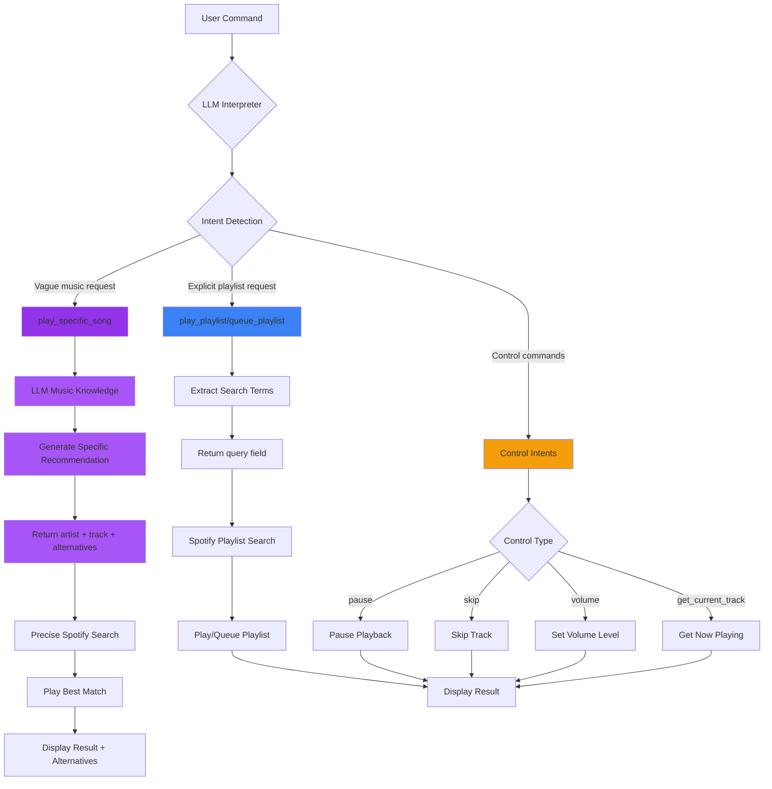

# Spotify Controller Intent System Architecture

## Overview

The Spotify Controller uses a discriminated union pattern for interpreting user commands, where different intents require different data structures and processing paths. This ensures intelligent song selection for vague requests while maintaining efficient playlist and control operations.

## System Flow Diagram



## Intent Types and Data Structures

### 1. `play_specific_song` Intent (Purple Path)

**When Used**: Vague music requests that require LLM's music knowledge

**Examples**:
- "play the most obscure Taylor Swift song"
- "play something for assassins creed"
- "play jpop for gaming"
- "play that desert driving scene song"

**Data Structure**:
```json
{
  "intent": "play_specific_song",
  "artist": "Taylor Swift",
  "track": "I'd Lie",
  "album": "Unreleased",
  "confidence": 0.9,
  "reasoning": "I'd Lie is one of Taylor Swift's most obscure tracks...",
  "alternatives": [
    "Taylor Swift - Beautiful Eyes",
    "Taylor Swift - Invisible",
    "Taylor Swift - Permanent Marker",
    "Taylor Swift - Dark Blue Tennessee",
    "Taylor Swift - By the Way"
  ]
}
```

**Processing**:
1. LLM uses music knowledge to identify specific song
2. Generates precise artist/track recommendation
3. Provides 5 alternative suggestions
4. Uses Spotify's precise search: `artist:"Taylor Swift" track:"I'd Lie"`
5. Frontend displays alternatives as clickable buttons

### 2. `play_playlist` / `queue_playlist` Intent (Blue Path)

**When Used**: Explicit playlist requests

**Examples**:
- "play my gaming playlist"
- "queue up a chill playlist"
- "play discover weekly"

**Data Structure**:
```json
{
  "intent": "play_playlist",
  "query": "gaming playlist",
  "confidence": 0.9,
  "reasoning": "User explicitly requested a gaming playlist"
}
```

**Processing**:
1. LLM extracts playlist search terms
2. Returns simple query field
3. Spotify searches for matching playlists
4. Plays or queues the best match

### 3. Control Intents (Orange Path)

**When Used**: Direct playback control commands

**Examples & Data Structures**:

#### Pause
```json
{
  "intent": "pause",
  "confidence": 0.95
}
```

#### Skip
```json
{
  "intent": "skip",
  "confidence": 0.95
}
```

#### Volume
```json
{
  "intent": "set_volume",
  "volume_level": 70,
  "confidence": 0.9
}
```

#### Current Track
```json
{
  "intent": "get_current_track",
  "confidence": 0.95
}
```

## Key Design Decisions

### 1. Discriminated Union Pattern
The system uses the `intent` field as a discriminator to determine which fields should be present:
- `play_specific_song` → requires `artist`, `track`, `alternatives`
- `play_playlist` → requires `query`
- `set_volume` → requires `volume_level`

### 2. Intelligent vs Generic Search
- **Intelligent**: For vague requests, LLM provides specific recommendations
- **Generic**: For playlists, pass search terms to Spotify's algorithm

### 3. Frontend Integration
The frontend automatically adapts based on the intent:
- Shows alternatives as clickable buttons for `play_specific_song`
- Displays intent badges with color coding
- Shows confidence levels as progress bars
- Displays reasoning in distinct purple boxes

## Implementation Details

### LLM Prompt Structure
```typescript
const prompt = `You are an advanced music command interpreter...

CRITICAL: You must distinguish between two types of play requests:

1. SPECIFIC SONG REQUESTS (intent: "play_specific_song")
   When users ask for songs using descriptions, moods, cultural references...
   
2. PLAYLIST REQUESTS (intent: "play_playlist" or "queue_playlist")
   When users explicitly ask for playlists...
```

### Search Query Building
```typescript
function buildSearchQuery(interpretation: any): string {
  // For play_specific_song intent, always use precise search
  if (interpretation.intent === 'play_specific_song' && 
      interpretation.artist && interpretation.track) {
    return `artist:"${interpretation.artist}" track:"${interpretation.track}"`;
  }
  
  // For playlists, use the query field
  return interpretation.query || interpretation.searchQuery;
}
```

## Benefits of This Architecture

1. **Preserves Magic**: Vague requests get intelligent, specific recommendations
2. **Efficient Playlists**: Playlist requests use Spotify's native search
3. **Clear Intent**: Users can see exactly what the system understood
4. **Extensible**: Easy to add new intents with their own data requirements
5. **Type Safety**: Discriminated unions ensure correct data for each intent

## Future Enhancements

- Add `play_album` intent for album-specific requests
- Add `play_genre` intent with mood/era modifiers
- Add `create_playlist` intent for dynamic playlist generation
- Add context-aware intents that consider current playing track